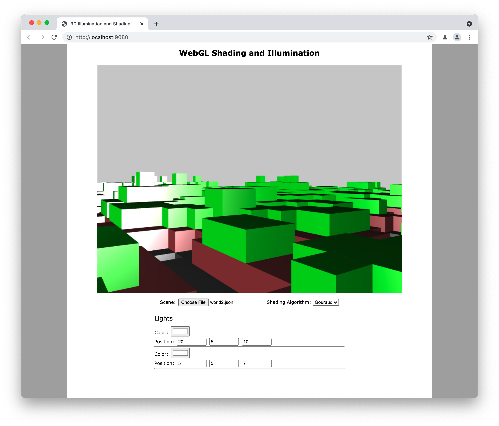

# WebGL Minecraft Generator/Viewer

This is a demo that I created for class in my last year of college.

Run the generator with `node generator.js`

Host the website in `main` locally, and select the json file you just generated. 
